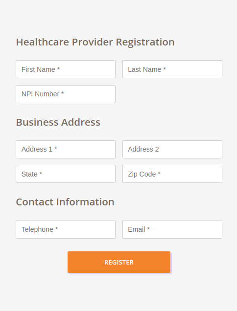

# Availity

### Q: Tell me about your proudest professional achievement.  It can be a personal or school project.

My proudest professional achievement is winning DataStax's Product & Engineering All-Star Award.
I earnd it by collaborating on the successful bootstraping of two new SaaS applications,
while creating and maintaining a shared library of React widgets for company image and re-use.

Additionally, it helped that I rose to the challenge of owning both projects on the User Interface side,
as the technical lead, when there was a need and the opportunity presented itself.

Being recognized, from these events, by my mentors at the company was a complementary reason to be proud of.

### Q: Tell me a about a book, blog, article or GitHub repo you read or liked recently, and why you like it and why you should recommend I do the same.

Oh, have I got a lot to share on this department:

#### A Book: `Clojure in Action`

##### Why you should read it

Besides being a book that touches on a different and powerful programming language,
 Clojure, and functional programming,
 it includes concepts such as: sane approach to concurrency with incredible concurrency primitives
 (software transactional memory features, no locks involved),
 an explanation on multiple types of polymorphism where,
 for example, subtype polymorphism is the most common form of polymorphism (included in Java and C++),
 but not the only one available.

It also discusses ad-hoc hierarchy and classifications without object oriented programming,
 contains several exercises and explanations on how reader-level macros can be used to create beautiful and clean code,
 and creates a distributed computation framework- creating workers with rabbitMQ.
The book also goes over technologies and topics such as caching with redis. 

#### A blog: 

http://blog.cognitect.com/blog/2017/8/14/restate-your-ui-creating-a-user-interface-with-re-frame-and-state-machines

This blog teaches how to represent the finite available states for a UI widget, so that conditionals are removed and
valid state and state transitions are documented and implemented bug-free and with a sane method. This is showcased with
clojurescript and re-frame, but this approach is compatible with javascript+React+Redux. 

#### Tech talk on youtube:

Maybe Not - https://www.youtube.com/watch?v=YR5WdGrpoug

Goes over schemas for data, validation, and pitfalls of strongly typed or object oriented languages athat utilize inflexible
"slots" to model the way. It is a fun talk to watch.

#### Github repo(s):
  - https://github.com/doczjs/docz

    I had tried out other similar technologies, but then ran into `docz`. It allows to easily build a playground + styleguide
    of an application's React components. Very useful to create standalone components that don't depend on the application
    they're used in, which in turn allows for cleaner breakdown of responsibilities and better separation of concerns when using the props interface.

  - https://github.com/noprompt/meander

  As developers, we usually have to transform structs of data. For example, we may have to convert this (pseduo code):
  ```js
  [
    {id: 1, sales: 3, state: 'FL', product: 'paper', ...},
    {id: 2, sales: 7, state: 'FL', product: 'table', ...},
    {id: 3, sales: 9, state: 'FL', product: 'pencil', ...}
  
    //...
  ]
  ```
  
  into
  
  ```js
  {
      salesReport: {
          paper: {
             total: 15
          },
          table: {
              total: 26
          },
          pencil: {
              total: 105
          }
      }
  }
  ```
  
  This usually becomes a pipeline of transformations, or calls for manual iteration and aggregation of data.
  These tasks are common ocurrences during software development.
  
  `Meander` proposes a fully declarative approach with the use of matching syntax. Developers may then describe 
  the original shape and desired shape, and the program transforms the data for the user. Declarative programming
  taken to the next level.

### Q: If you were to describe to a 7-year old what Availity does, what would you say?

Availity helps doctors earn their money and save money while doing so.

It does so by providing a website where doctors can just type our information and
receive all answers on what to do, instead of making long and boring phone calls.

With all of this, we can all buy more ice cream, and be healthier, with the time and money saved.

### Q: Coding exercise: You are tasked to write a checker that validates the parentheses of a LISP code. Write a program (in Java or JavaScript) which takes in a string as an input and returns true if all the parentheses in the string are properly closed and nested.

#### **`./index.js`**
```js
/**
* Given a string, scans content and checkes whether parentheses are balanced, ala LISP.
* Assumptions: very simple LISP. No difference between atoms and functions. No strings allowed.
**/
function lispChecker(str) {

    const stack = [];

    const iterator = str[Symbol.iterator]();
    let char = iterator.next();

    while (!char.done) {
        const { value } = char;

        if (value === '(') {
            stack.push(value);
        }
        if (value === ')') {
            stack.pop();
        }
        char = iterator.next();
    }

    // Stack should be empty for balanced s-expressions
    return !stack.length;
}
```

The above function is defined under `./index.js`, and some tests are under `./test.js`
The tests run using mocha after installing dependencies (npm install or yarn install) on `./package.json`

To run the tests: `yarn install && yarn test`.

See https://www.npmjs.com/package/yarn if npm and node is installed, in order to install yarn (`npm i -g yarn`).

### Q: Coding exercise for frontend engineer

Healthcare providers request to be part of the Availity system. Using React framework, create a registration user interface so healthcare providers can electronically join Availity.

The following data points should be collected:
- First and Last Name
- NPI number
- Business Address
- Telephone Number
- Email address

#### Solution: 

- Used a theme (orange color, light background) and feel in line with what I saw at <https://availity.com>.
- See `./registration-ui/` for the application, bootstrapped with create-react-app.
- See `./doc/registration.png` and other screenshots of the running application.
- See `./doc/README.md` for development notes on these exercises (mostly registration-ui).
- See `./registration-ui/README.md` for installing, running for development, and building application.

Notes: project contains a nested `package.json`. Requires another npm/yarn install within `./registration-ui/` folder.
Solution compatible and tested with latest versions of Google Chrome and Firefox on Ubuntu Linux.



** All README.md files at different levels of this project are important in order to build,
analyze, and preview documentation and screenshots of the project. **
