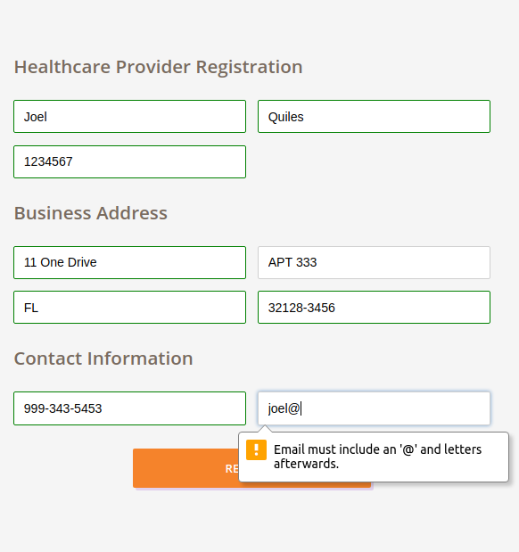
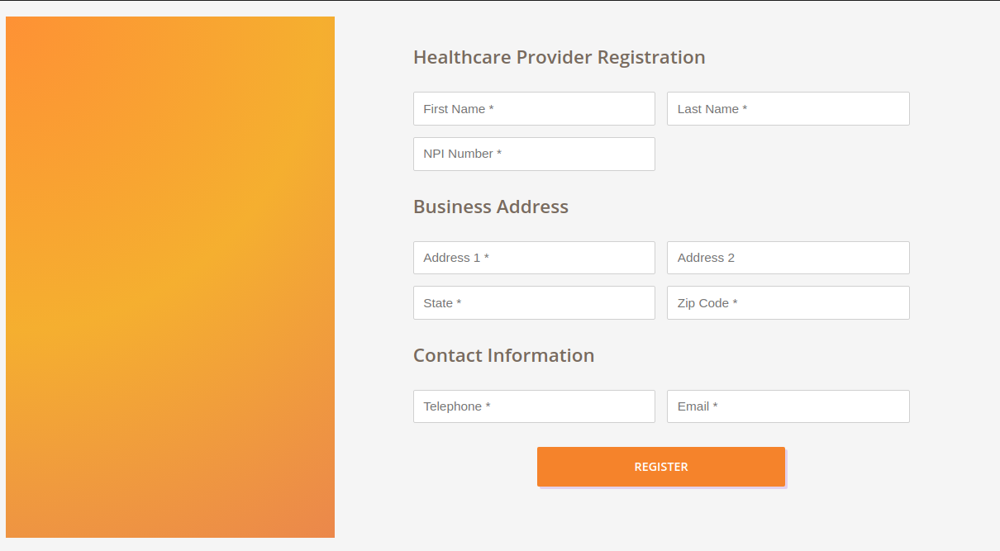
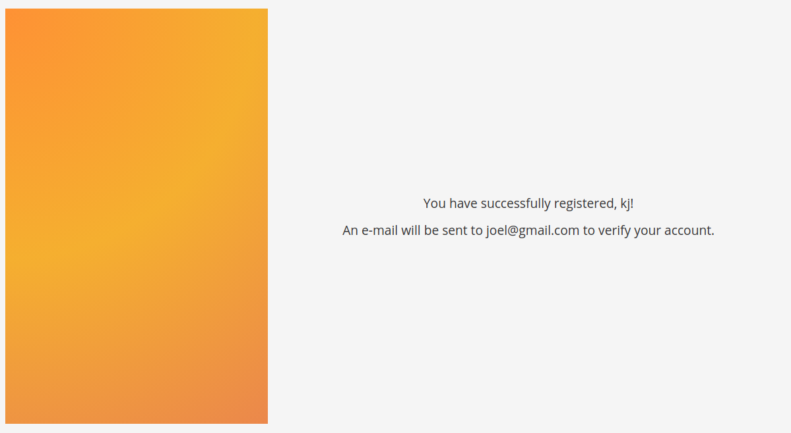

This folder contains documentation and screenshots of the application.

## Other developer notes

Seeing that this is a simple exercise in the scope of an interview, I built everything from scratch.
The project only utilizies tools included with create-react-app (+ react-router-dom). Additionally,
no advanced styling solutions were used (such as emotion, styled-components, etc). In the past,
 I have worked with Material-UI for a great sensible component library, where the themes and styles can be
 customized so that they don't exactly follow material design guidelines. This also means that other very
 useful libraries in more complex projects, such as lodash, were not needed.

The registration UI leverages on the simple HTML5 element "validation" API.
See https://developer.mozilla.org/en-US/docs/Web/Guide/HTML/HTML5/Constraint_validation .

### All screenshots of the registration UI

#### Smaller Screens

#### After submitting, with validation

#### Wider screens, with a gradient placeholder:

This placeholder can be replaced by an image, added another container within
and marketing messages, etc.

#### Simple confirmation of registration

This is mostly a placeholder, to show that the data is available to make requests and
return to the user, if necessary.
